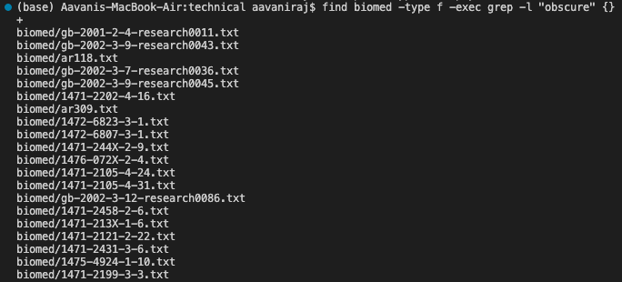
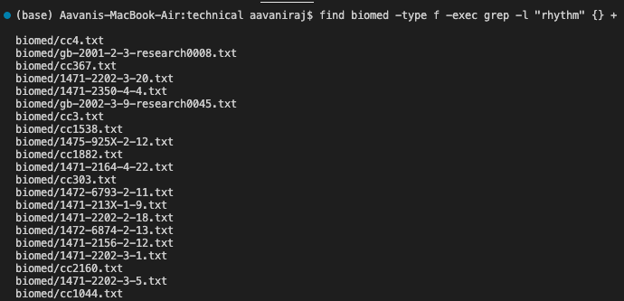

# Lab Report 3

The command I chose is the find command.

## 1. ```find /path/to/directory -type f -size +1M``` or ```find /path/to/directory -type f -size -1M```

This is useful because it will help find files larger or smaller than a specific size within the specified directory and its subdirectories.


This screenshot shows all the files in the biomed directory with a size less then 1MB.


This screenshot shows all the files in the biomed directory with a size greater then 1MB and 10MB. In this case, there are none.


- Searches for files larger or smaller than a specific size
- Found using [ChatGPT](chat.openai.com)
  - Input to ChatGPT: "different ways to use find command"
  - Output from ChatGPT:


## 2. ```find /path/to/directory -mtime n```

This is useful because it helps you find files that are empty, so that if you want to remove/delete files with no content in them, you would be able to.


This screenshot shows all the files in the biomed directory that are empty (do not have any text in them).


This screenshot shows all the files in the plos directory that are empty. In this case there are none.


- Searches for files that are empty
- Found using [ChatGPT](chat.openai.com)
  - Input to ChatGPT: "different ways to use find command"
  - Output from ChatGPT:


## 3. ```find /path/to/directory -type f -exec grep -l "keyword" {} +```

This is useful because if you are doing research on a specific topic or looking for a specific keyword, this command will help you find files that contain that keyword to narrow your search.


This screenshot shows all the files that are listed in the biomed directory that contain the keyword "obscure".


This screenshot shows all the files that are listed in the plos directory that contain the keyword "rhythm".


- Used to search for all the files in a directory that contain the specified string
- Found using [ChatGPT](chat.openai.com)
  - Input to ChatGPT: "find command to find files with specific keyword"
  - Output from ChatGPT:


## 4. ```!find```


This screenshot shows the use of the ```find``` command to list all the files in the biomed directory.


This screenshot shows the use of the ```!find``` command to execute the last find command which lists all the files in the biomed directory. This screenshot has identical output to the previous screenshot.


This screenshot shows the use of the ```find``` and ```!find``` command to find the file 1468-6708-3-4.txt in the biomed directory and to execute the last find command to find the file 1468-6708-3-4.txt again.

- Used to execute the last find command that was excuted
- Found using [This website](https://javarevisited.blogspot.com/2018/08/10-example-of-find-command-in-unix-linux.html#axzz814DzeJv2)
- ChatGPT was not used to find this command.


