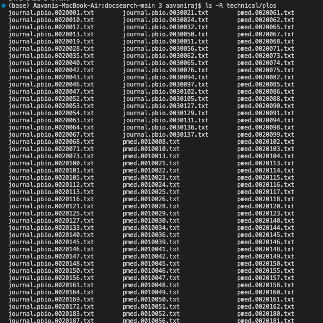
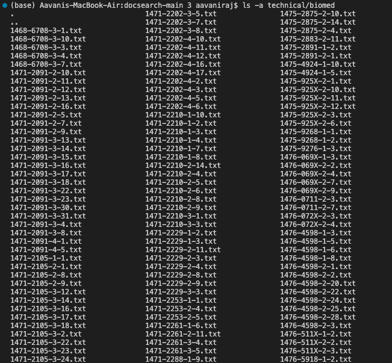
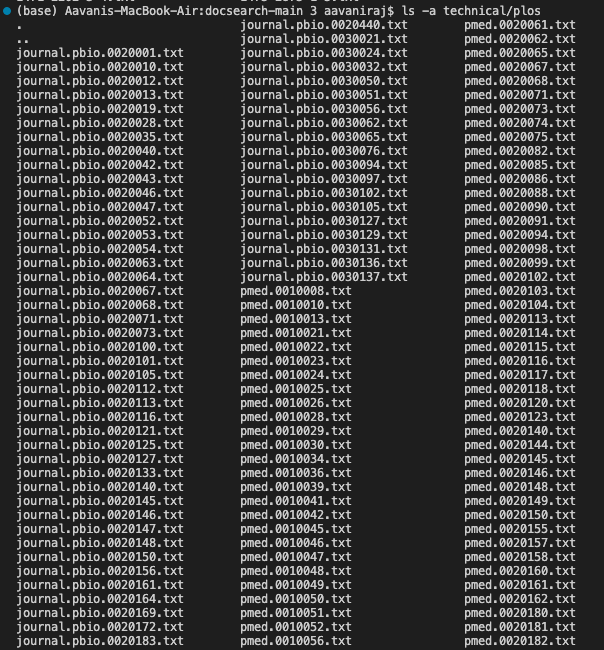

# Lab Report 3

The command I chose is the find command.

1. ```ls -R /path/to/directory```




- Recursively lists all the files and directories in a directory
- Found using ChatGPT

2. ```ls -a /path/to/directory```




- Lists all files, including hidden ones, in a directory
- Found using ChatGPT

3. ```grep -r "string" /path/to/directory```


- Used to search for all the files in a directory that contain the specified string
- Found using ChatGPT


4. ```!find```


- Used to execute the last find command that was excuted
- Found using https://javarevisited.blogspot.com/2018/08/10-example-of-find-command-in-unix-linux.html#axzz814DzeJv2


