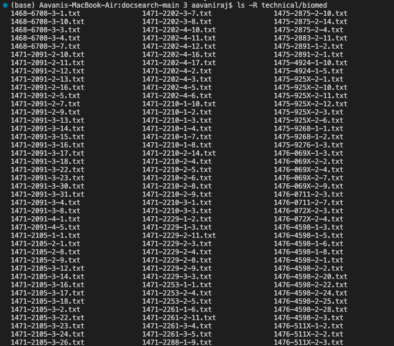
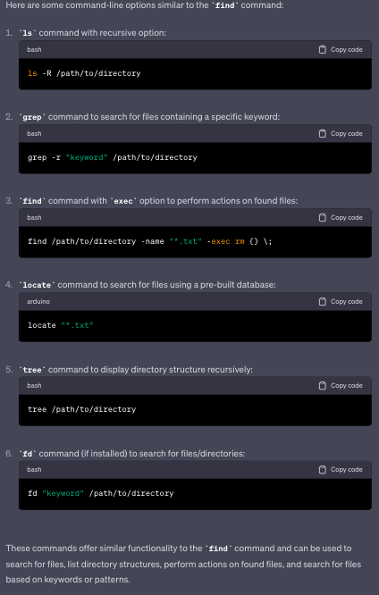
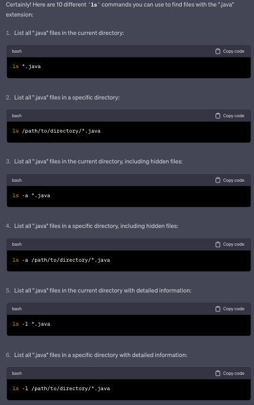
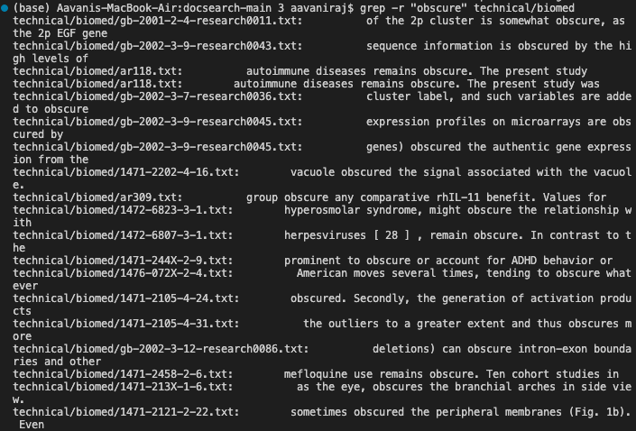
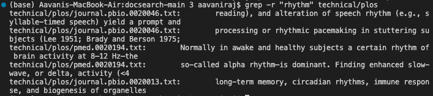
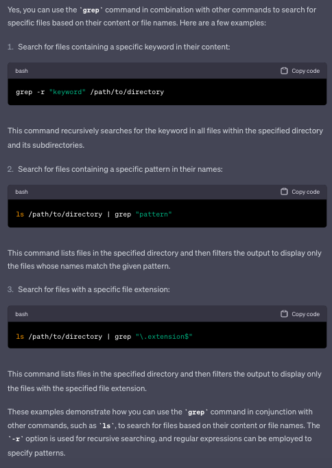

# Lab Report 3

The command I chose is the find command.

## 1. ```ls -R /path/to/directory```

This is useful because it listst files recursively which can help with efficiently searching for files and file analysis.


This screenshot shows all the files in the biomed directory. The files are listed recursively.


This screenshot shows all the files in the plos directory. The files are listed recursively.


- Recursively lists all the files and directories in a directory
- Found using ChatGPT
  - Input to ChatGPT: "command in the command line options similar to find command"
  - Output from ChatGPT:



## 2. ```ls -a /path/to/directory```

This is useful because it lists hidden files in addition to regular files which the find command does not fo.


This screenshot shows all the files in the biomed directory including hidden files. However, since there were no hidden files in this case, it simply lists all the files.


This screenshot shows all the files in the plos directory including hidden files. However, since there were no hidden files in this case, it simply lists all the files..


- Lists all files, including hidden ones, in a directory
- Found using ChatGPT
  - Input to ChatGPT: "give me  10 ls commands to find files in java"
  - Output from ChatGPT:




## 3. ```grep -r "string" /path/to/directory```

This is useful because if you are doing research on a specific topic or looking for a specific keyword, this command will help you find files tat contain that keyword to narrow your search.


This screenshot shows all the files that are listed in the biomed directory that contain the keyword "obscure".


This screenshot shows all the files that are listed in the plos directory that contain the keyword "rhythm".


- Used to search for all the files in a directory that contain the specified string
- Found using ChatGPT
  - Input to ChatGPT: "can you use grep command to find files"
  - Output from ChatGPT:




## 4. ```!find```


This screenshot shows the use of the ```find``` command to list all the files in the biomed directory.


This screenshot shows the use of the ```!find``` command to execute the last find command which lists all the files in the biomed directory. This screenshot has identical output to the previous screenshot.


This screenshot shows the use of the ```find``` and ```!find``` command to find the file 1468-6708-3-4.txt in the biomed directory and to execute the last find command to find the file 1468-6708-3-4.txt again.

- Used to execute the last find command that was excuted
- Found using [This website](https://javarevisited.blogspot.com/2018/08/10-example-of-find-command-in-unix-linux.html#axzz814DzeJv2)
- ChatGPT was not used to find this command.

13 and 10?


